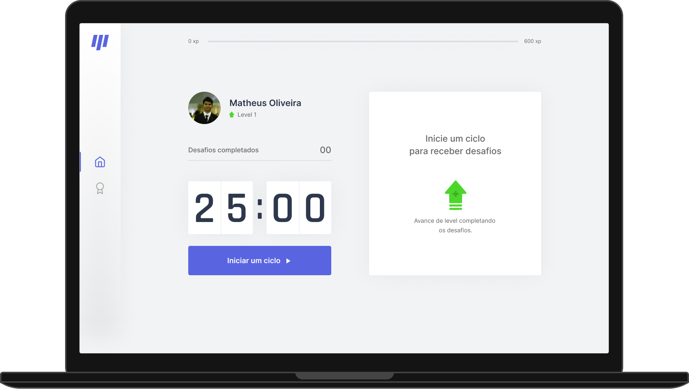
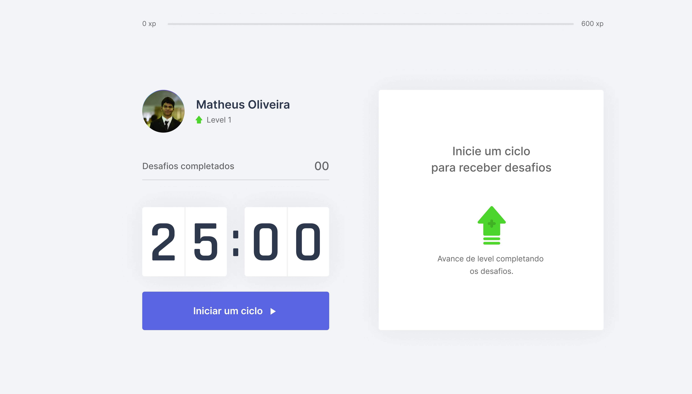
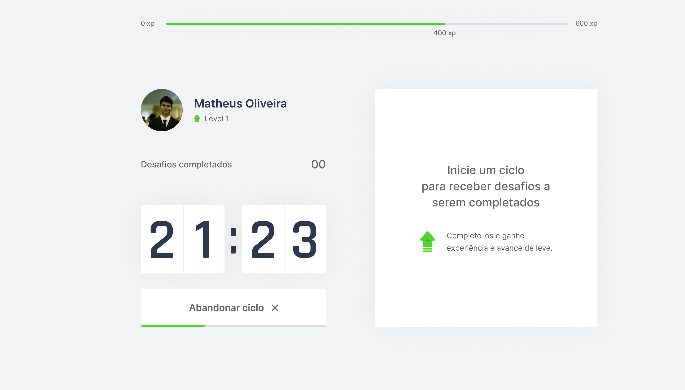
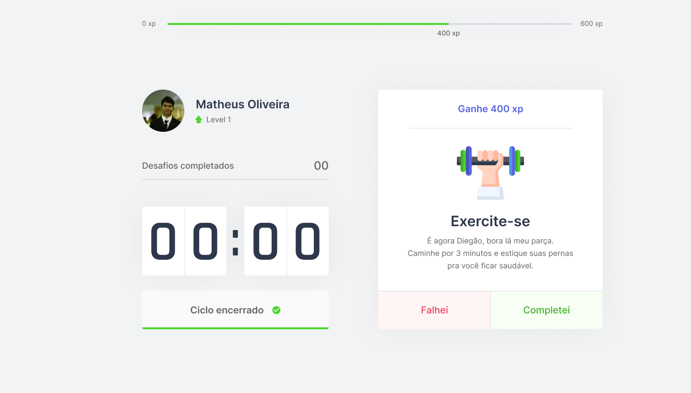
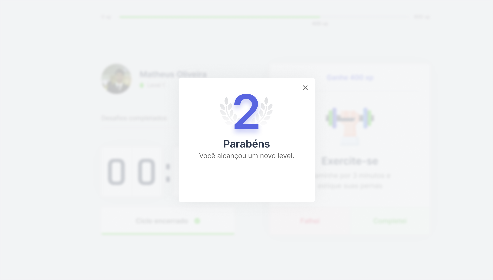

<div align="center">


[NLW](#nlw) |
[ABOUT](#about) |
[FUNCTIONALITIES](#functionalities) |
[GET START](#getting-start) |
[SCREENSHOTS](#screenshots)
[LAYOUT](#layout)

---



</div>

# <p id='nlw'>🚀 NLW#4</p>

NLW (next-level-week) is an intensive week managed by [Rocketseat](https://rocketseat.com.br/).

> The trail i decided to follow was with ReactJS, where we developed.

---

# <p id='about'>📕 About Move.it</p>

Move-it, an application with the objective of making you exercise when you work every twenty five minutes.

---
# <p id='functionalities'>⚙ Functionalities</p>

- Experiece Bar(with each complete. challenge them bar grows).
- Complete challenge count.
- Twenty Five timer.
- Challenge Box (contains more than 10 challenges).

---

# <p id='getting-start'>🏁 Getting Start</p>

First clone this repository:

```shell

$ git clone https://github.com/Matheus0liveira/move.it.git

# and

$ cd move.it

```

And now install dependencies:


```shell

# Execute

# Using yarn

$ yarn 

# or using npm

$ npm install

```

For running this project, execute:

```shell

# Using yarn

$ yarn dev

# or using npm

$ npm run dev

```

Now your project is running at http://localhost:3000

---

# <p id='screenshots'>📸 Screenshots</p>






---

# <p id='layout'>🖌 Layout</p>

Version 1.0 - [figma](https://www.figma.com/file/TNuT90awAV84dkkNyh3fLb/Move.it-1.0-Copy?node-id=160%3A2761)

Version 2.0 - [figma](https://www.figma.com/file/ODkmY4W3QbKY2RyNyRZUE5/Move.it-2.0-Copy?node-id=160%3A2761)